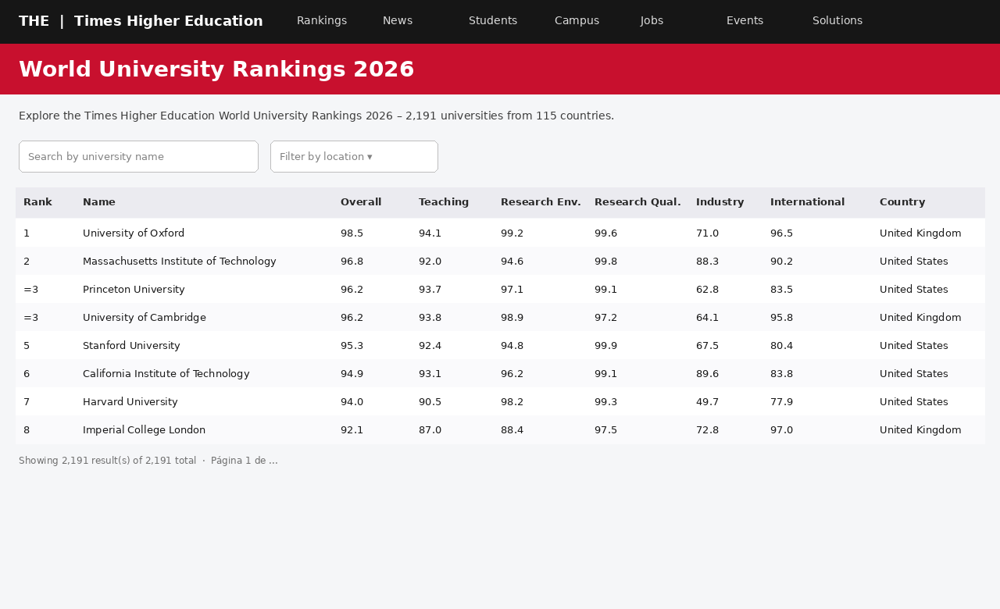
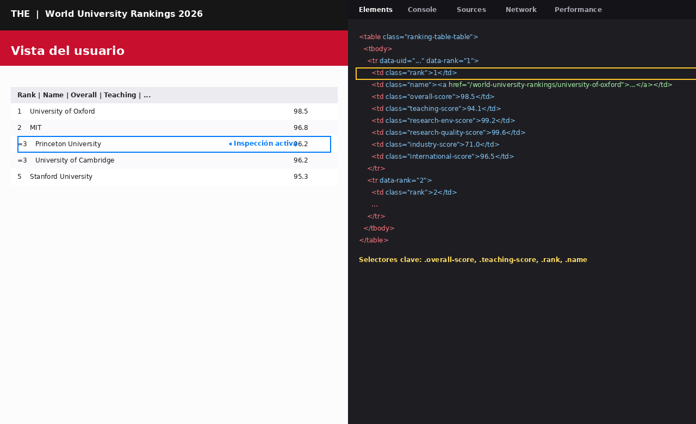

[](https://mybinder.org/v2/gh/razekmh/World-University-Rankings-Table/HEAD)

# World University Rankings 2026 – ETL desde Times Higher Education

## Objetivo
Este repositorio automatiza la extracción de datos desde el sitio web de *Times Higher Education* (THE) mediante *web scraping*. El enfoque es un caso práctico: tomar la lógica original del proyecto (Selenium + BeautifulSoup) y adaptarla a la última versión publicada por THE (**2026**), con sus nuevos pilares metodológicos y tres vistas de ranking: global, por disciplina y regional.

Las URLs fuente se encuentran en el archivo `Web Scrapping from Times higher Education_Latest.txt` e incluyen:

- **World University Rankings 2026** – ranking global de universidades.
- **Subject Rankings 2026 – Business & Economics** – ranking por disciplina.
- **Latin America University Rankings 2026** – ranking regional para Latinoamérica.

## 1. Prerrequisitos
- Python 3.9 o superior.
- Jupyter Notebook o cualquier entorno capaz de ejecutar Python.
- Navegador **Google Chrome** o **Chromium** instalado en la máquina.
- Librerías Python (ver `requirements.txt`): `beautifulsoup4`, `selenium`, `webdriver-manager`, `requests`, `pandas`, `lxml`.

> Ya **no** es necesario descargar manualmente `chromedriver.exe`. El paquete `webdriver-manager` descarga de forma automática la versión del driver compatible con el Chrome instalado. Si tenías un `chromedriver.exe` del proyecto antiguo, puedes borrarlo.

Instalar dependencias:

```bash
pip install -r requirements.txt
```

## 2. ¿Qué datos vamos a obtener?
Esta es la primera pregunta que conviene responder antes de tocar una sola tecla. En nuestro caso partimos de la idea de recolectar la lista de universidades con su puesto en el ranking. Para entender cómo hacerlo visitamos primero el sitio y observamos la estructura de sus páginas.

La vista que ofrece THE a sus usuarios luce así:


<br/><br/>

La página muestra una tabla con los datos que queremos. Sin embargo, la recolección dependerá del HTML que se esconde detrás de lo que se ve en el navegador. En Chrome se presiona **F12** para abrir las *Developer Tools* y localizar los selectores que utilizará el scraping:


<br/><br/>

Con el cursor de inspección identificamos las clases CSS (por ejemplo `overall-score`, `teaching-score`, `research-env-score`, `research-quality-score`, `industry-score`, `international-score`) que representan los campos que nos interesan. Estos serán los que rastreemos con BeautifulSoup.

## 3. Enfoque técnico
Un método estándar para traer una página con Python es la librería `requests`. En nuestro caso no funciona, porque THE modifica el HTML en el navegador mediante **AJAX/JavaScript**: lo que nos entregaría `requests` sería una plantilla vacía sin datos. Para dejar que el JavaScript corra y la tabla se llene usamos **Selenium**, que controla un navegador real y nos entrega el HTML cuando la página ya ha terminado de cargarse. Una vez con el HTML, **BeautifulSoup** localiza los selectores y extrae el texto de cada celda.

```python
import json, re, time
import pandas as pd
import requests
from bs4 import BeautifulSoup as soup
from selenium import webdriver
from selenium.webdriver.chrome.service import Service
from selenium.webdriver.chrome.options import Options
from selenium.webdriver.common.by import By
from selenium.webdriver.support.ui import WebDriverWait
from selenium.webdriver.support import expected_conditions as EC
from webdriver_manager.chrome import ChromeDriverManager
```

### 3.1 Inicializar el driver (sin `chromedriver.exe` manual)

```python
options = Options()
options.add_argument('--headless=new')
options.add_argument('--window-size=1920,1080')
driver = webdriver.Chrome(service=Service(ChromeDriverManager().install()), options=options)
```

### 3.2 URLs de los tres rankings

```python
RANKINGS = {
    'world_2026': 'https://www.timeshighereducation.com/world-university-rankings/latest/world-ranking',
    'business_economics_2026': 'https://www.timeshighereducation.com/world-university-rankings/2026/subject-ranking/business-and-economics',
    'latam_2026': 'https://www.timeshighereducation.com/world-university-rankings/2026/latin-america-university-rankings',
}
```

> Truco que se mantiene desde la versión original: agregar el sufijo `#!/length/-1/sort_by/rank/sort_order/asc` a las URLs fuerza a la tabla a mostrar todas las filas en una sola página.

### 3.3 Lectura del HTML y extracción de datos

```python
driver.get(url + '#!/length/-1/sort_by/rank/sort_order/asc')
WebDriverWait(driver, 25).until(
    EC.presence_of_element_located((By.CSS_SELECTOR, 'table tbody tr'))
)
pagina = soup(driver.page_source, 'html.parser')

for tr in pagina.select('table tbody tr'):
    rank   = tr.find('td', {'class': re.compile('rank')}).get_text(strip=True)
    nombre = tr.find('td', {'class': re.compile('name')}).find('a').get_text(strip=True)
    overall = tr.find('td', {'class': re.compile('overall-score')}).get_text(strip=True)
    # ... (teaching, research_env, research_quality, industry, international)
```

THE ajusta sus clases CSS de vez en cuando. El notebook incluye un mapa `COLUMNAS_CSS` con varios alias por columna para robustecer el parsing.

### 3.4 (Opcional) Enriquecer con la dirección de cada universidad
Cada universidad tiene una página de perfil (`https://www.timeshighereducation.com/world-university-rankings/<slug>`) que contiene un bloque JSON-LD (`<script type="application/ld+json">`) con su dirección. El notebook recorre esas páginas y extrae `streetAddress`, `addressLocality`, `addressRegion`, `postalCode` y `addressCountry`, más la dirección completa en texto. Esta parte se puede desactivar con la variable `OBTENER_DIRECCIONES = False`.

### 3.5 Limpieza y guardado
Antes de guardar eliminamos símbolos (`%`, `,`), normalizamos el `rank` (quitamos `=`, `+` y rangos tipo `201–250`) y reemplazamos `n/a` por nulos. Cada ranking se guarda en su propio `.csv`:

| Clave | Archivo |
|-------|---------|
| `world_2026`              | `the_world_ranking_2026.csv` |
| `business_economics_2026` | `the_subject_business_economics_2026.csv` |
| `latam_2026`              | `the_latam_ranking_2026.csv` |

```python
df.to_csv(cfg['archivo_salida'], index=False, encoding='utf-8-sig')
```

## 4. Estructura del repositorio

```
.
├── README.md
├── Web Scrapping from Times higher Education_Latest.txt   # URLs fuente (2026)
├── _config.yml
├── requirements.txt                                       # dependencias pip
├── index.ipynb                                            # notebook ETL
└── img/
    ├── basic_page_01.PNG                                  # vista del ranking
    └── page_code_02.PNG                                   # inspección DevTools
```

## 5. Ejecución rápida
1. Instalar dependencias: `pip install -r requirements.txt`.
2. Abrir `index.ipynb` en Jupyter (`jupyter notebook` o VS Code).
3. Ejecutar todas las celdas ("Run All"). Al terminar encontrarás los tres archivos CSV en la raíz del proyecto.

## 6. Mantenimiento
Si THE vuelve a cambiar los nombres de las clases CSS, el único lugar que normalmente necesita ajustarse es el diccionario **`COLUMNAS_CSS`** dentro del notebook. Agrega el nuevo alias y el resto del flujo sigue funcionando.
